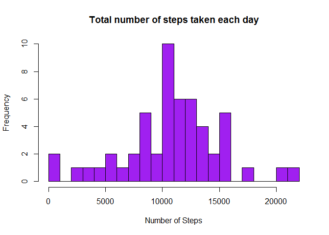
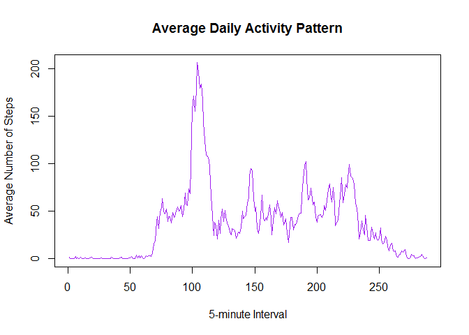
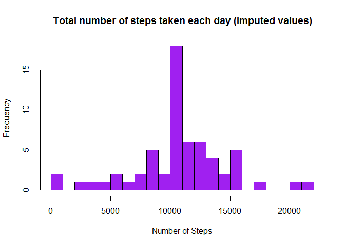
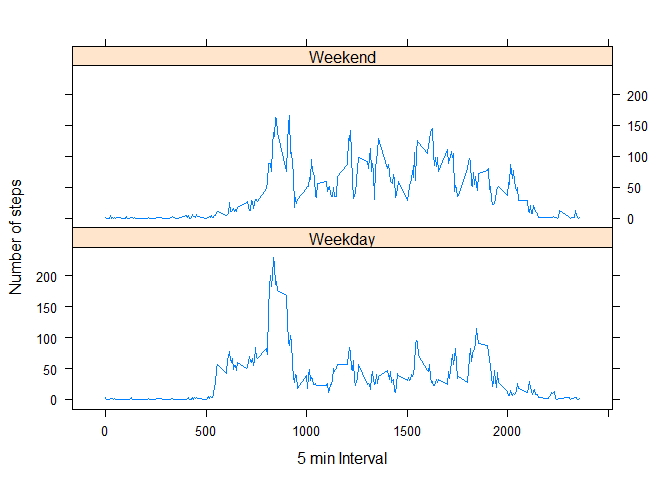

# Reproducible Research: Peer Assessment 1
Leela P.  

This is the 1st Peer Assessment for the course Reproducible Research of the Data Science Specialization on Coursera.


##Introduction

It is now possible to collect a large amount of data about personal movement using activity monitoring devices such as a Fitbit, Nike Fuelband, or Jawbone Up. These type of devices are part of the “quantified self” movement – a group of enthusiasts who take measurements about themselves regularly to improve their health, to find patterns in their behavior, or because they are tech geeks. But these data remain under-utilized both because the raw data are hard to obtain and there is a lack of statistical methods and software for processing and interpreting the data.

This assignment makes use of data from a personal activity monitoring device. This device collects data at 5 minute intervals through out the day. The data consists of two months of data from an anonymous individual collected during the months of October and November, 2012 and include the number of steps taken in 5 minute intervals each day.


##Data

Dataset: [Activity monitoring data](https://d396qusza40orc.cloudfront.net/repdata%2Fdata%2Factivity.zip)
  
 The variables included in this dataset are:   
 
* steps: Number of steps taking in a 5-minute interval (missing values are coded as NA)
* date: The date on which the measurement was taken in YYYY-MM-DD format
* interval: Identifier for the 5-minute interval in which measurement was taken

The dataset is stored in a comma-separated-value (CSV) file and there are a total of 17,568 observations in this dataset.


## 1. Loading and preprocessing the data


### 1.1 First we are loading the Data from the .csv file to a variable called "Data" (how original!) and we are taking a look at the structure and the summary of the Data.

```r
Data <- read.csv("activity.csv", header = TRUE, sep = ",")

str(Data)
```

```
## 'data.frame':	17568 obs. of  3 variables:
##  $ steps   : int  NA NA NA NA NA NA NA NA NA NA ...
##  $ date    : Factor w/ 61 levels "2012-10-01","2012-10-02",..: 1 1 1 1 1 1 1 1 1 1 ...
##  $ interval: int  0 5 10 15 20 25 30 35 40 45 ...
```

```r
summary(Data)
```

```
##      steps                date          interval     
##  Min.   :  0.00   2012-10-01:  288   Min.   :   0.0  
##  1st Qu.:  0.00   2012-10-02:  288   1st Qu.: 588.8  
##  Median :  0.00   2012-10-03:  288   Median :1177.5  
##  Mean   : 37.38   2012-10-04:  288   Mean   :1177.5  
##  3rd Qu.: 12.00   2012-10-05:  288   3rd Qu.:1766.2  
##  Max.   :806.00   2012-10-06:  288   Max.   :2355.0  
##  NA's   :2304     (Other)   :15840
```


### 2.1 We are now converting the 'date column' to fit the date format and we are taking a look at the first rows of our Data.

```r
Data$date <- as.Date(Data$date)

head(Data) 
```

```
##   steps       date interval
## 1    NA 2012-10-01        0
## 2    NA 2012-10-01        5
## 3    NA 2012-10-01       10
## 4    NA 2012-10-01       15
## 5    NA 2012-10-01       20
## 6    NA 2012-10-01       25
```


## 2. What is mean total number of steps taken per day?

### 2.1 We are now going to calculate the total number of steps taken per day.

```r
steps_per_day <- tapply(Data$steps, list(Data$date), sum)
```


### 2.2 We are proceeding by making a histogram of the total number of steps taken each day.

```r
hist(steps_per_day, breaks=20, col = "purple", xlab = "Number of Steps", main= "Total number of steps taken each day")
```

 


### 2.3 Here, we are going to calculate the mean and median of the total number of steps taken per day

```r
mean(steps_per_day, na.rm = TRUE)
```

```
## [1] 10766.19
```

```r
median(steps_per_day, na.rm = TRUE)
```

```
## [1] 10765
```


## 3. What is the average daily activity pattern?

### 3.1 Here we are going to make a time series plot (of the 5-minute interval and the average number of steps taken) averaged across all days.

```r
steps_per_interval <- tapply(Data$steps, list(Data$interval), mean, na.rm = TRUE)

plot(steps_per_interval, type = "l", xlab = "5-minute Interval", ylab = "Average Number of Steps", main = "Average Daily Activity Pattern",  col ="purple")
```

 


### 3.2 We want to find out which 5-minute interval, on average across all the days in the dataset, contains the maximum number of steps.

```r
which.max(steps_per_interval)
```

```
## 835 
## 104
```

```r
max(steps_per_interval)
```

```
## [1] 206.1698
```

We can see that the 5-minute interval that contains the maximum number of steps is the interval **835** and the maximum numbers of steps is about **206**.


## 4. Imputing missing values

### 4.1 We are going to calculate the total number of missing values in our dataset.

```r
missing_values <- sum(is.na(Data$steps))

missing_values
```

```
## [1] 2304
```

The total number of rows that have missing values is **2304**. Now we just have to figure out a plan on how to deal with these missing values.


### 4.2 We are going to explain the strategy for filling the missing values in the dataset.

There are a few options on how we should fill the missing data (= number of steps). One option would be to use the mean or the median for that particular date. Another option would be to use the mean for that particular 5-minute interval.  

My view is that the optimal effect fpr the dataset can be achieved  by using the mean of the 5-minute interval each NA value belongs to. 
There might be different reasons why the NA values are in the dataset to begin with and if we examined those reason further we might come up with the best strategy overall.


### 4.3 We are creating a new dataset, where the missing values are filled.

Here, we are creating a new dataset, replacing the NA values with the mean for the 5 minute intervals.
Below the code, you can notice that the total number of NA values is computed again. This time the value should be 0, since the codle replaces all of them.


```r
na_values <-  which(is.na(Data))
imputed_values <- steps_per_interval[as.character(Data[na_values,3])]
names(imputed_values) <- na_values

for (i in na_values) {
  Data$steps[i] = imputed_values[as.character(i)]
}

sum(is.na(Data)) 
```

```
## [1] 0
```


### 4.4 We are making a histogram of the total number of steps taken each day. We will also calculate the mean and the median and we are going to see if these values are any diffent form the ones calculated in the previous step.

```r
total_steps <- tapply(Data$steps, Data$date, sum)

hist(total_steps,breaks=20, col="purple", xlab="Number of Steps", 
     ylab="Frequency", main="Total number of steps taken each day (imputed values)")
```

 

```r
mean(total_steps)
```

```
## [1] 10766.19
```

```r
median(total_steps)
```

```
## [1] 10766.19
```

As we can observe from the output of the code, the mean values are the same, although we can see a minimal difference between the medians.


## 5. Are there differences in activity patterns between weekdays and weekends?

### 5.1 Creating a new factor variable in the dateset with two levels ('weekday' and 'weekend', indicating if a given date is a weekday or a weekend day).

Here, we are seperating the Days on the Dataset to two groups: Weekdays and Weekends. We want to observe if there is any difference in activity between them.

```r
Days <- weekdays(Data$date)

Data$day_type <- ifelse(Days == "Saturday" | Days == "Sunday", 
                           "Weekend", "Weekday")

mean_steps <- aggregate(Data$steps,
                       by=list(Data$interval,
                               Data$day_type),mean)

names(mean_steps) <- c("interval","day_type","steps")
```


### 5.2 Making a panel plot containing the time series plot we created earlier in the assignment.

```r
library(lattice)


xyplot(steps~interval | day_type, mean_steps, type="l",
       layout=c(1,2), xlab="5 min Interval", ylab = "Number of steps")
```

 

On the panel plots, we can observe the differences in activity between Weekdays and Weekends. 

Even tough I would expect a different result, it seems that there is more activity during the Weekdays. Especially, early in the day, Weekdays are much more active. On Weekends, on the other hand, the activities seem more evenly spread throughout the day.
